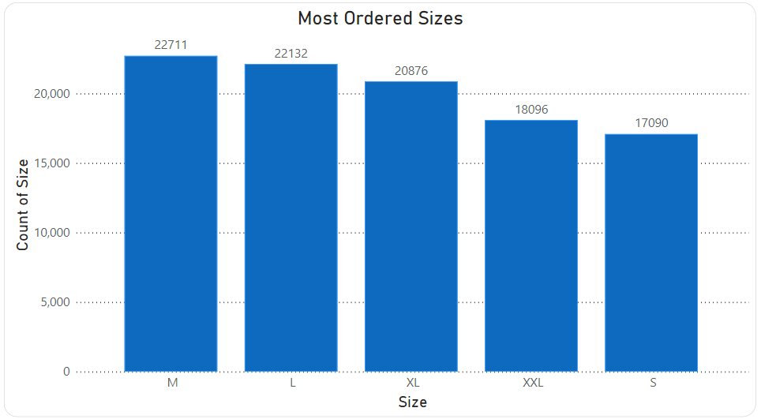
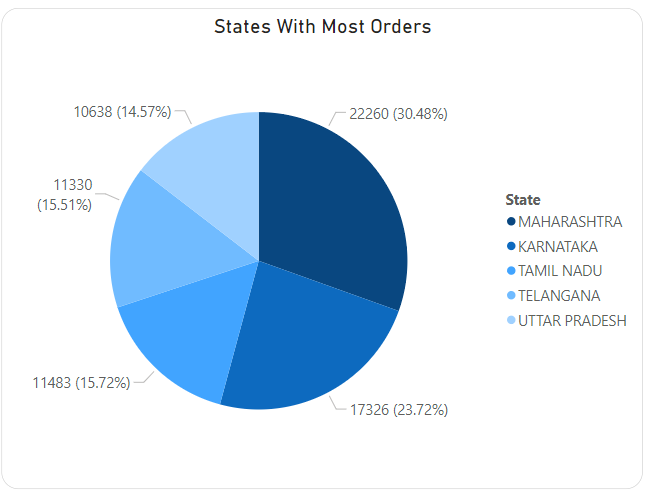
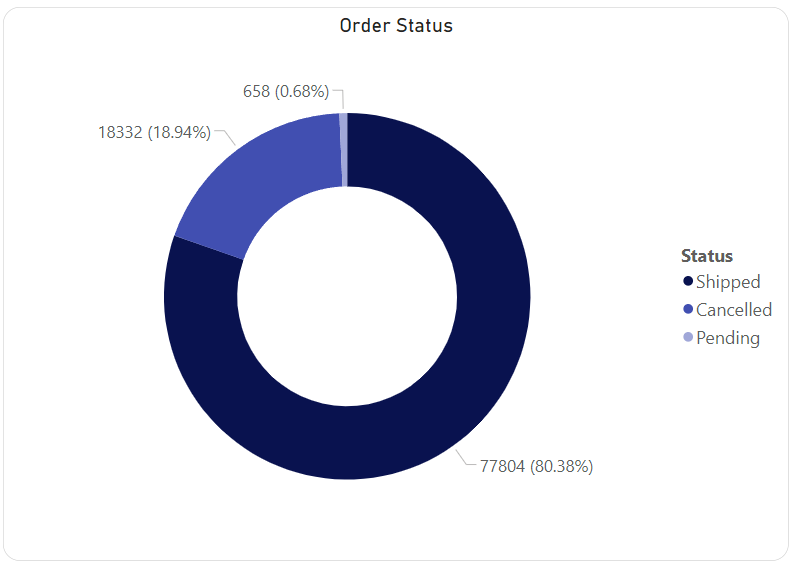
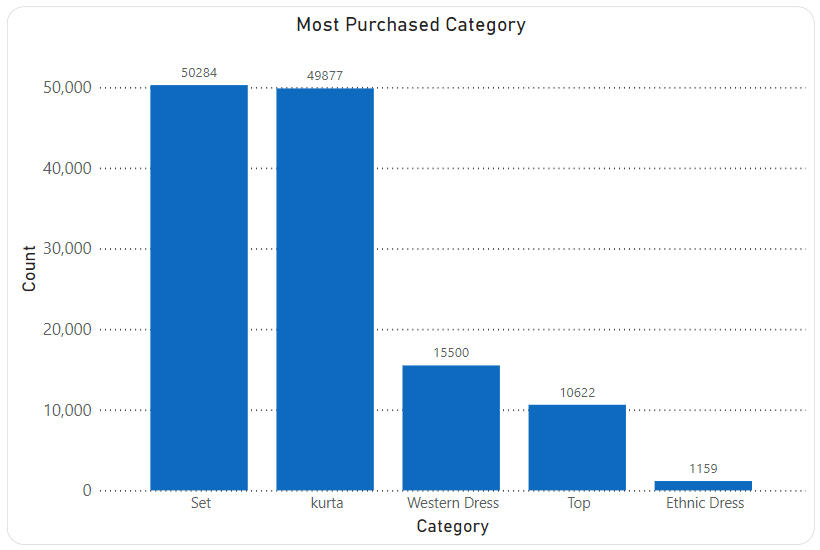

# Amazon Sale Report Visualization

## Overview

This repository contains the code and files for cleaning and visualizing an Amazon sales report dataset. The dataset was sourced from Kaggle, and the data processing was performed using Python in Google Colab. The cleaned dataset was then visualized using Power BI for comprehensive insights.

## Table of Contents

- [Prerequisites](#prerequisites)
- [Dataset](#dataset)
- [Data Cleaning](#data-cleaning)
- [Power BI Visualization](#power-bi-visualization)
  - [Most Ordered Sizes](#most-ordered-sizes)
  - [States With Most Orders](#states-with-most-orders)
  - [Order Status](#order-status)
  - [Most Purchased Category](#most-purchased-category)
- [Usage](#usage)
- [License](#license)

## Prerequisites

Before running the code, make sure you have the following tools installed:

- Python (for data cleaning)
- Google Colab (for running Python code in the cloud)
- Power BI Desktop (for visualization)

## Dataset

The Amazon sale report dataset used in this project is sourced from Kaggle and can be found [here](https://www.kaggle.com/datasets/thedevastator/unlock-profits-with-e-commerce-sales-data). The dataset includes details on e-commerce sales; you can download it directly from the Kaggle platform.

## Data Cleaning

The data cleaning process was performed using Python in Google Colab. The notebook `EcomData.ipynb` details the step-by-step process of loading the dataset, handling missing values, and dropping unnecessary columns. This ensures that the data is in a suitable format for visualization.

## Power BI Visualization

### Most Ordered Sizes

### States With Most Orders

### Order Status

### Most Purchased Category

The cleaned dataset was imported into Power BI Desktop for visualization. The `amazon_sale_report.pbix` file contains the Power BI report, showcasing various visualizations such as charts, graphs, and tables to represent key insights from the Amazon sale report data.

